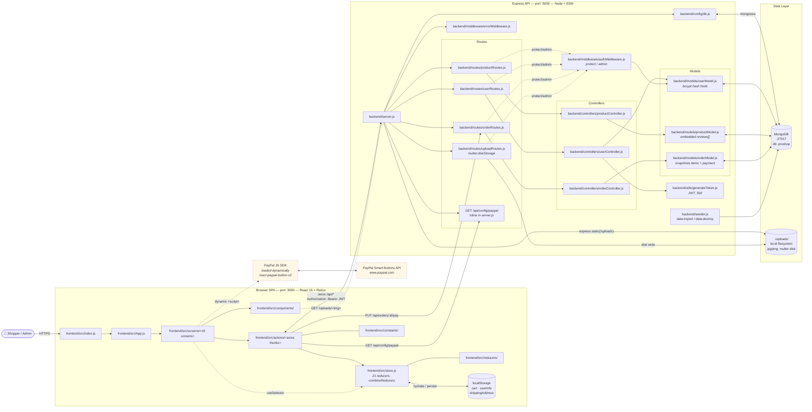

# ProShop — Architecture

## 1. Identity Card

| Field | Value |
|---|---|
| Language | JavaScript (ES Modules in backend, JSX in frontend) |
| Backend stack | Node + Express 4 + Mongoose 8 + `express-async-handler` + `jsonwebtoken` 9 + `multer` 2 |
| Frontend stack | React 16.13 + classic Redux 4 + redux-thunk + react-router-dom 5 + axios 0.20 + react-bootstrap 1 + `react-paypal-button-v2` |
| Build tooling | `react-scripts` 3.4.3 (CRA, ejected-style configs not modified) |
| Module system | Backend `"type": "module"` (ESM with explicit `.js` extensions); frontend CRA/webpack default |
| ~LOC | **1 377** backend (`backend/**/*.js`) + **4 080** frontend (`frontend/src/**/*.js`) ≈ **5 460** |
| First commit | `bb57332` — *React setup* — **2020-09-23** |
| Last commit | `b4f6752` — *docs: add FINDINGS audit report* — **2026-04-29** |
| Project age | ~5 years 7 months |
| Active periods (≥2 commits/month) | **2020-09** (71), 2020-10 (16), 2020-11 (2), 2023-04 (2), **2026-04** (4) |
| Contributors | Brad Traversy (84), Basir (8), Alexander (4) |
| Tests | **1** Jest unit file: `backend/__tests__/createProductReview.test.js`. No backend integration tests, no frontend tests. |
| Deployment artifacts | Heroku (`Procfile`, `heroku-postbuild`), Docker Compose (`docker-compose.yaml`) |

## 2. Architecture Map (C4-container)

Subgraphs are *containers* (deployable units); nodes inside use real file paths
to the modules that own each responsibility.

### Notable flows captured above

- **Same-origin / no CORS** — frontend axios uses relative `/api/*`; CRA proxy
  in dev (`frontend/package.json` proxy field), Docker-rewritten proxy in
  compose, Express static serving in prod (`backend/server.js`). See
  [ADR-0002](adr/0002-same-origin-via-cra-proxy.md).
- **JWT + localStorage** — `backend/utils/generateToken.js` mints,
  `backend/middleware/authMiddleware.js` verifies, `frontend/src/store.js`
  hydrates `userInfo` from `localStorage`. See
  [ADR-0001](adr/0001-jwt-bearer-with-localstorage.md).
- **Disk-backed uploads** — `backend/routes/uploadRoutes.js` writes via
  `multer.diskStorage` into `./uploads/`; the same file is served by
  `express.static` in `backend/server.js`. Bind-mounted in Docker.
- **PayPal payment is client-driven** — `react-paypal-button-v2` is loaded
  via a `<script>` tag injected at runtime in
  `frontend/src/screens/OrderScreen.js`; the backend currently *trusts* the
  `paymentResult` posted to `/api/orders/:id/pay` (see Health Report below).

## 3. Health Report

### 3.1 Churn hotspots — change frequency over the project's lifetime

| File | Commits touching it |
|---|---|
| `frontend/src/store.js` | 21 |
| `frontend/src/App.js` | 19 |
| `frontend/src/actions/userActions.js` | 15 |
| `frontend/src/actions/productActions.js` | 11 |
| `backend/server.js` | 11 |
| `frontend/src/screens/ProductScreen.js` | 10 |
| `frontend/src/reducers/userReducers.js` | 10 |
| `frontend/src/reducers/productReducers.js` | 9 |

The two top spots are exactly the modules that fan out to all 21 reducers and
all 18+ routes — symptomatic of the use-case-sharded Redux pattern (see
[ADR-0003](adr/0003-redux-reducer-per-use-case.md)): adding any operation
forces edits in 3-4 files.

### 3.2 Risky / outdated dependencies

| Where | Pin | Risk |
|---|---|---|
| `frontend/package.json` | `react@16.13.1`, `react-scripts@3.4.3`, `axios@0.20.0` | ~5 years stale, dozens of transitive CVEs (per FINDINGS.md row 1) |
| `frontend/package.json` | `react-paypal-button-v2@2.6.2` | unmaintained wrapper around legacy PayPal Smart Buttons |
| `backend/package.json` | `bcryptjs@2.4.3`, `dotenv@8.2.0`, `morgan@1.10.0` | not critical but stale; `dotenv` lost some sync APIs in newer majors |
| Backend (already fixed in `1690bce`) | `jsonwebtoken` 8 → 9, `multer` 1 → 2, `mongoose` 5 → 8 | CVE bumps, breaking changes adapted |

### 3.3 Test gaps

| Surface | Coverage |
|---|---|
| Backend controllers | 1 of 3 controllers has tests (`productController.createProductReview` only) |
| Backend middleware (auth, error) | None |
| Backend models / hooks (bcrypt pre-save, schema validators) | None |
| Frontend reducers | None |
| Frontend thunks (axios actions) | None |
| Screens / integration | None |
| End-to-end (cart → checkout → pay → admin deliver) | None |

No `npm test` script exists in the root `package.json`; Jest runs require
`NODE_OPTIONS=--experimental-vm-modules npx jest` because of `"type": "module"`.

### 3.4 Behavior gaps surfaced during onboarding

(Cross-references to `FINDINGS.md`; numbers match that file.)

| # | Severity | Where | One-liner |
|---|---|---|---|
| 2 | 🔴 | `backend/controllers/orderController.js` | `updateOrderToPaid` trusts client-supplied PayPal result — no server-side verification |
| 3 | 🔴 | `frontend/src/screens/PlaceOrderScreen.js` | direct mutation of Redux state during render; broken `cartItems === 0` empty-cart guard |
| 5 | 🔴 | `backend/middleware/authMiddleware.js` | `next()` is inside `try` — downstream errors masked as "token failed" |
| 6 | 🟡 | `backend/controllers/orderController.js`, `backend/config/db.js` | dead `return` after `throw`; legacy mongoose options that became no-ops post-bump |
| 7 | 🟡 | various | magic numbers (`tax = 0.15`, `freeShipping ≥ 100`, `pageSize = 10`, `JWT 30d`) scattered across files |
| 9 | 🟢 | `backend/server.js` | `app.listen(PORT, console.log(...))` — passes `undefined` as the listen callback |

### 3.5 Naming / structural smells

- **21 top-level reducer keys** in the Redux store (`productList`, `productDetails`,
  `productCreate`, ..., `orderListMy`, `orderList`) — high surface, easy
  rename mistakes when a new operation is added.
- **`productReducers.js` repeats the same `_REQUEST/_SUCCESS/_FAIL/_RESET`
  switch** seven times; no `createAsyncReducer` helper.
- **`orderModel.js` snapshots `orderItems`/`shippingAddress`/`paymentResult`**
  inline (a deliberate choice for historical accuracy), but the schema isn't
  documented — easy to assume it joins `Product` and try to "normalize" it.
- **`backend/server.js`** mixes API routing, static asset serving, and
  prod/dev branching in a single 60-line module — fine for now, but the
  `app.get('*')` SPA-fallback hides any future `/api/...` 404 by accident.

## 4. Codebase Story

**The big bang of 2020 (Sep–Nov), then five years of cold storage.** Brad
Traversy committed 71 times in September 2020 alone — building from
`React setup` through cart, login, order placement, PayPal integration, and
admin CRUD in roughly six weeks. By the end of October the shape we still
have today was in place: the use-case-sharded Redux store
(`store.js`, churn 21), the routes → controllers → models split in the
backend, JWT + localStorage auth, multer-to-disk uploads, and CRA same-origin
proxy. Basir contributed eight commits in October–November on top of that
(mostly admin screens). After November 2020 the project effectively
hibernates: 1 commit in 2021, 2 in 2023, none in 2024–2025. The upstream
README explicitly marks the repo deprecated in favor of `proshop-v2` (Redux
Toolkit).

**The April 2026 revival is operational, not architectural.** Alexander's
four commits add the things needed to *run* the app safely against modern
Mongo and modern Node — Docker Compose with a healthcheck'd Mongo + seeder
service (`4075406`), CVE-driven dependency bumps for `jsonwebtoken@9`,
`multer@2`, `mongoose@8` (`1690bce`), an admin-gate + size-limit on the
upload route (`bf9ea70`), and a written-down audit (`FINDINGS.md`) plus the
characterization-test scaffold under `backend/__tests__/`. None of the 2020
architectural shapes were changed: same Redux structure, same auth flow,
same CRA proxy, same disk uploads. The implicit contract is *"keep this
running on modern stacks long enough to learn from, but treat
`proshop-v2` as the place to actually evolve features."* That's why the
ADRs in [docs/adr/](adr/) document existing decisions rather than propose
new ones — the goal of M2 onboarding is mapping the territory, not
redrawing it.
